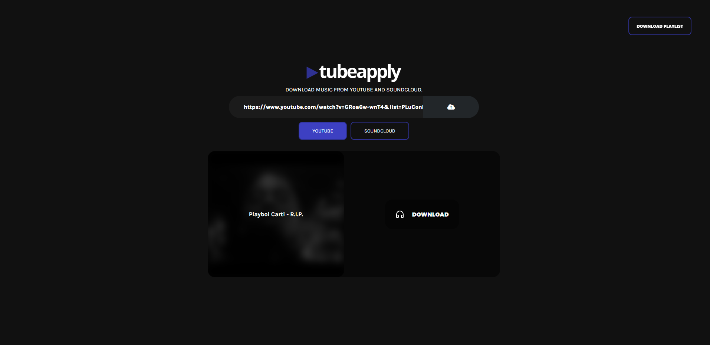
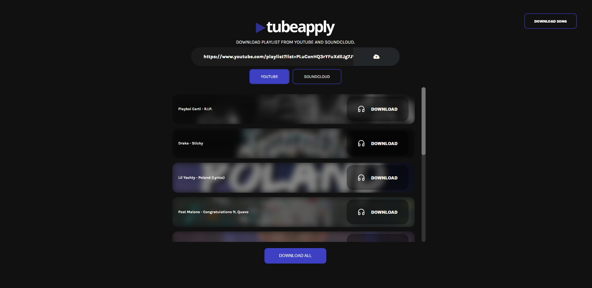

<!-- PROJECT LOGO -->

### Song Downloader

<br />
<br />
<div align="center">
  <a href="https://github.com/gymerr0rz/fs-inkwell">
    
  </a>
</div>

### Playlist Downloader

<br />
<br />
<div align="center">
  <a href="https://github.com/gymerr0rz/fs-inkwell">
    
  </a>
</div>

### Built With

- React
- Nodejs
- Styled-Components
- Express

<!-- GETTING STARTED -->

## Getting Started

This is an example of how you may give instructions on setting up your project locally.
To get a local copy up and running follow these simple example steps.

### Prerequisites

This is an example of how to list things you need to use the software and how to install them.

- npm
  ```sh
  npm install npm@latest -g
  ```

### Installation

_Below is an example of how you can instruct your audience on installing and setting up your app. This template doesn't rely on any external dependencies or services._

1. Clone the repo
   ```sh
   git clone https://github.com/gymerr0rz/tubeapply.git
   ```
2. Install NPM packages inside ./interface & ./server
   ```sh
   npm install
   ```
3. Starting the application
   ```sh
   Go inside ./interface && ./server and for each one type yarn start/npm start
   ```
